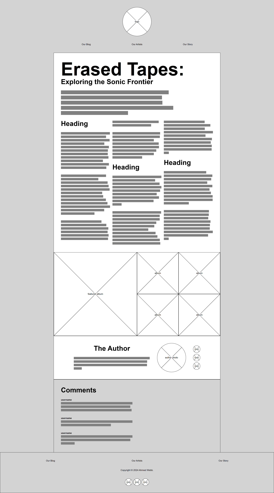

# Clone Task 1: Layout in React

Your task is to create the website for a blog post about the Erased Tapes Records music label. 

You must implement the website according to the [written specification](#specification) and [desktop wireframe](wireframes/desktop-wireframe.png) provided. For any details that have not been specified, you must make appropriate decisions about how to implement that detail. All required elements are shown in the wireframe. Specific measurements and values are outlined below.

The images and placeholder text you will need are provided in the [`assets`](assets) folder.

## Specification

1. The content background colour should be white. The page background colour should be `#e9e9e9`. The footer background colour should be `#14181d`.

2. The logo and the author's photo should each be `200px` wide.

3. The social media icons should be `50px` wide.

4. The standard spacing between elements should be `50px`. The spacing between each social media icons should be `10px`.

5. Typography should adhere to the following specification:
    
    1. Headings should use the `"Protest Guerrilla"` font family. All other text should use `"Josefin Sans"`. These should be imported from [Google Fonts](https://fonts.google.com).
    2. Headings should be three times larger than the default font size. The title heading should be much larger, as shown in the wireframe.
    3. The first paragraph should be a larger font.
    4. Typography and spacing should be optimised to make the text as legible as possible. Therefore, paragraphs and headings do not have to use the standard spacing.

## Desktop Wireframe

